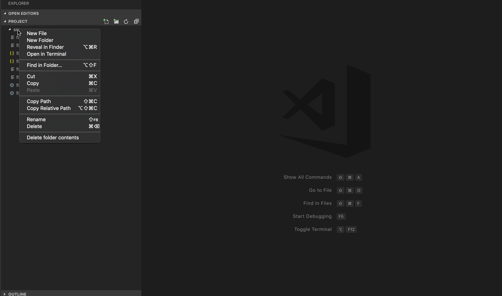

# Delete Folder Contents

A simple vscode extension that enables you to delete all contents (files + folders) inside a folder

## Change Log
See Change Log [here](CHANGELOG.md)

## Issues
Submit the [issues](https://github.com/ktkization/vscode-delete-folder-contents/issues) if you find any bug or have any suggestion.

## Contribution
Fork the [repo](https://github.com/ktkization/vscode-delete-folder-contents) and submit pull requests.

Icon made by [Icongeek26](https://www.flaticon.com/authors/icongeek26) from www.flaticon.com 
